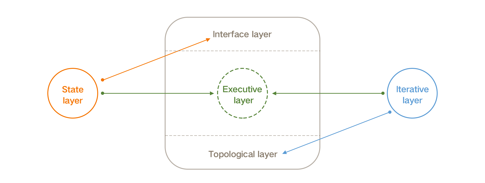
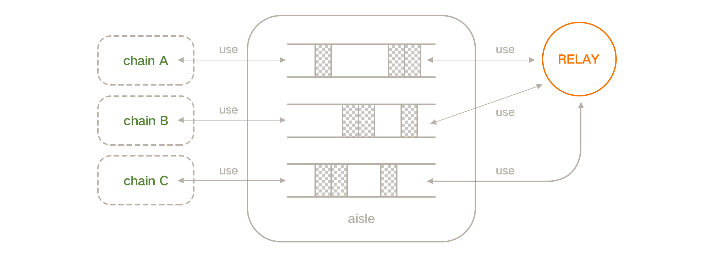
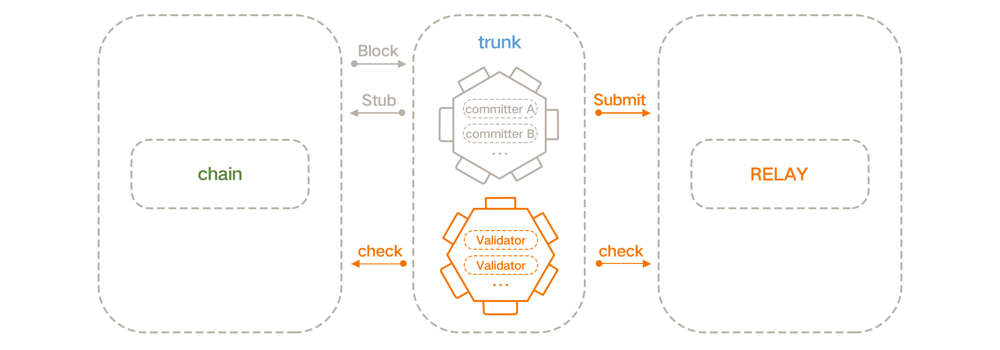
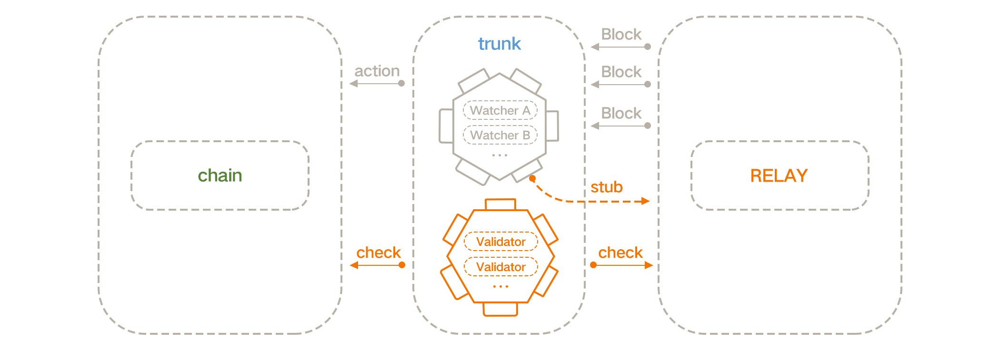
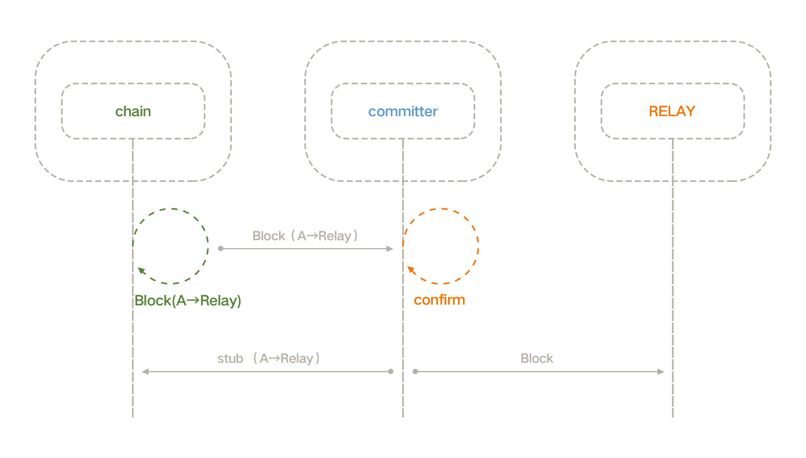
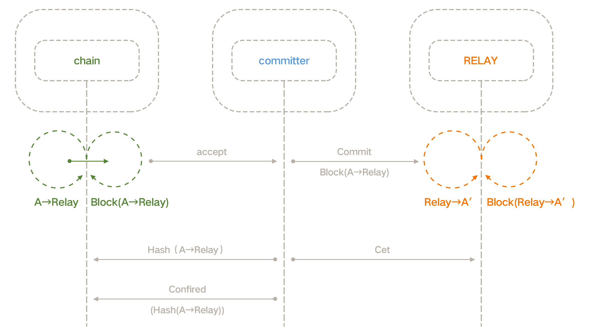
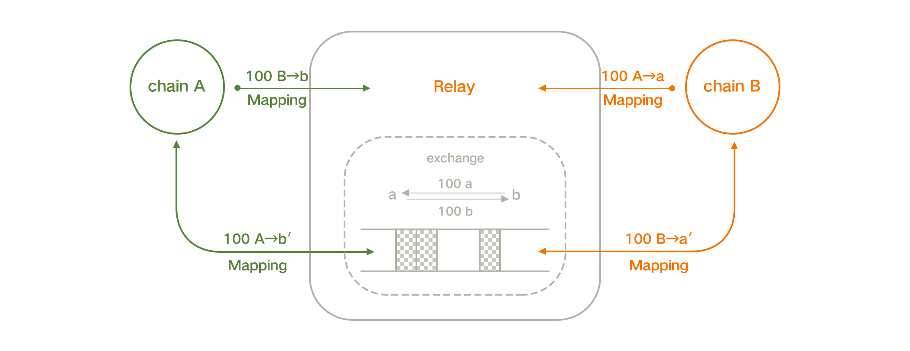
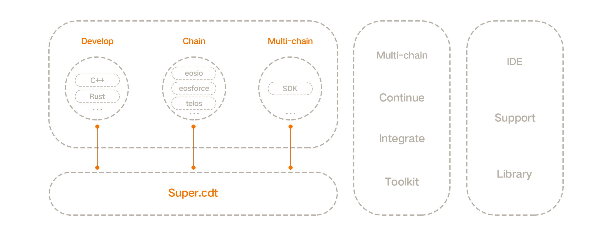
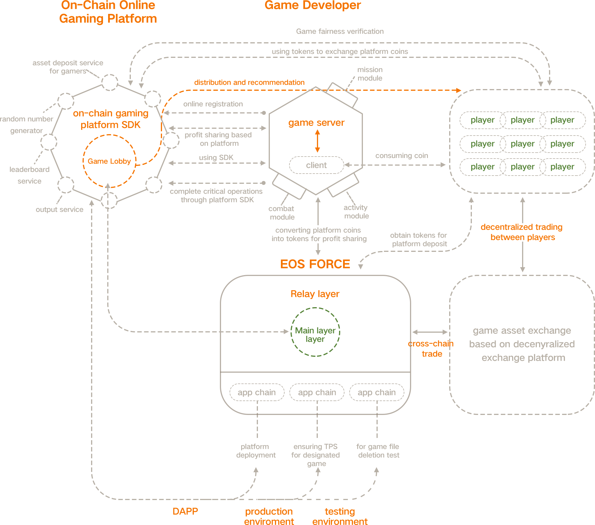

# CODEX : 开放包容的高性能多链平台

## 1. 背景

未来一段时间内, 区块链技术会和目前成熟的数据库技术一样,
呈现多种不同架构链并存, 多链并存, 同时即存在为通用需求而服务的通用链, 也存在为特殊需求而服务的特化链,同时即存在面向大众的公链, 也存在面向特定用户的私有链.
另一方面, 随着区块链技术的日益落地应用, 各个链之间的交互需求会日益紧密, 不同确认机制下的跨链需求将会极其常见.

未来的区块链架构师将会根据其面临的需求, 将会选择最合适的几种公链或私链来处理不同需求, 同时会为各个链之间选择合适的跨链方式, 以此将整个系统整合起来, 这类似与当前的数据库技术, 在当今常见的软件架构中, 往往会根据数据的使用需求选择不同的数据库存储, 之后通过不同的技术, 如消息队列、RPC接口等来进行各个数据库及用户之间数据的传递与读写.

当前很多声音认为未来将会出现少数可以解决所有问题的区块链技术出现, 很多项目也以此作为卖点和目标, 但是对比现有成熟的技术, 实际上, 由于需求迥异, 在考虑成本及效率的情况下, 任何技术都没有找到放之四海皆准的解决方案, 区块链技术同样如此.

## 2. 愿景

`CODEX`致力于建立一个开放包容的高性能多链生态, 为区块链的实际落地提供支持.

## 3. 技术架构

Codex是一套多链技术生态建设方案, 主要包括三大方面:

- `Codex.IO Framework` : 高性能模块化区块链底层框架
- `Codex.Relay` : 高性能跨链服务
- `Codex.SDP` : 多链开发工具集

### Codex.IO Framework

如上分析, 当讨论多链生态中的架构时, 解决问题的思路应该倾向于使用特定实现的链来高效的解决特定的需求,
这要求开发者可以快速的启动一条链, 同时只需要关注特定实现的部分, 如果想要达到这一点, 需要一系列完善高可定制化的区块链开发框架,

为此, 我们构想并设计了Codex.IO项目, 这一项目的目标是构建一个高可定制高性能的区块链开发框架,

为了保证区块链的拓展性和性能, Codex.IO选择基于类POS共识算法作为其主要的共识方向,
目前EOSIO作为最具有可用性的类POS开发框架, 我们将会在当前阶段采用最具备可用性的EOSIO作为底层开发框架，
在未来我们会在更去中心化和扩展性更强的方向上探寻更好的解决方案.

EOS技术是一种极具潜力的区块链开发技术,
一方面, 基于DPOS共识, EOS链可以在当下满足超过4000+TPS的需求,
另一方面, EOS提供了一套可以开发中大规模DAPP的智能合约开发平台.

基于以上两点, 在中长期之内, EOS技术以一套行之有效何以快速落地的区块链技术,
虽然其他技术也同样极具潜力, 但是需要很长一段时间的完善, 对于任何一个技术的应用, 从零到一总是最难也是最关键的,
由此我们选则基于EOS技术开发Codex.IO项目.

但是EOS技术毕竟是一个特定的公链项目, 这意味着在EOS中, 设计者不会考虑过多的链拓展性,
因此我们需要对EOS技术进行一次彻底的解构, 这也是Codex.IO的一项主要工作.

#### Codex.IO层次化架构

为了满足不同的需求, Codex.IO需要做到‘三个无关’ : 共识无关,虚拟机无关,接口无关,
这样基于Codex.IO的开发者可以根据其需求选择不同的共识算法, 不同的执行虚拟机, 并且可以方便的增加或者修改原有链的接口,
为了达到这个目的, 我们设计了全新的分层区块链基础开发框架, 剥离原有各个层次之间的依赖.

Codex.IO架构：

#### 拓扑层

拓扑层体现为区块拓扑结构, 最常见的区块拓扑结构即使区块链, 当然不同的共识算法会决定区块拓扑结构的不同.

将拓扑层剥离出来可以使得Codex.IO便于适配不同的共识算法, 从原始的DPOS实现, 也可以转变为POS, POW等实现, 更可以采用DAG等不同的区块拓扑结构的共识算法.

#### 迭代层

为了分割执行层和拓扑层, 我们引入了区块迭代层来向执行层隐藏区块层的细节.

#### 执行层

执行层体现为行为逻辑, 在EOS极其衍生技术中, 行为由Action定义, 系统负责解释Action并依此更新链状态机,

在解释Action的过程中, 虚拟机是非常重要的部分, 除了少量由C++层实现的Action之外, 其他的Action都在虚拟机中执行,
在Codex.IO中, 我们将会实现模块化的虚拟机实现, 通过将执行层与其他模块分离,
Codex.IO将适配不同的虚拟机系统, 从BTC脚本这样的特定实现, 到WASM/JVM/V8这样的通用虚拟机, 甚至Lua/Python这样的嵌入式语言运行时,
这会极大的减少传统企业拥抱区块链的的技术门槛, 使得区块链技术的引入不会影响企业原有的技术体系,
另一方面, 一些简单易用的语言平台可以吸引更多的开发者实现其创意.

#### 状态层

在绝大多数区块链技术中, 节点会维护一个具备准实时读写效力的状态机系统,
在EOS中这个系统体现为EOS节点的内存数据,
目前这些数据存储在EOS实现的一个不算完善的可落地内存数据库中.
丰富的数据结构可以帮助开发者更好更快的实现其需求,
所以在Codex.IO中, 我们在执行层中分离状态机的实现, 形成一个承上启下的状态层,
由此一方面允许开发者拓展更多的内存数据结构类型, 帮助开发者更好的实现DAPP.
另一方面这样一个层的引入可以向界面层隐藏执行层的实现细节.

#### 界面层

界面层主要体现为链对外部的API和节点间的P2P协议,

不同用途的链注定需要提供不同的API接口, Codex.IO需要允许二次开发者简单快捷的增加和修改链的API,
在各种主流XX技术架构中, 往往会根据不同的需求使用不同的API实现方案,比如通用的HTTP RES API, 以及如gRPC、SOAP等各种XXXRPC实现, 还有各种消息队列等等.
区块链作为全新价值传输网络，在与当前世界各个业务的交互中, 必须保持良好的兼容性,降低价值交换的门槛.
当前开发者需要自行实现对原有系统的接口, 如各种EOS的插件, 开发者不得不投入大量时间重写开发已有业务接口逻辑.
为了使开发者聚焦在本身的业务开发中, 我们设计了独立的界面层, 通过状态层与其他层次解耦.

另一方面, 作为去中心化的区块链系统, P2P协议是节点间组网的基础协议, 在EOS中, 设计者自行实现了一套不算完善的协议, 虽然在一定程度上可以更换实现, 但是需要大量的开发工作.
而Codex.IO中, 我们将适配主流的P2P协议, 如`libp2p`.

综上所述, Codex.IO致力于完成一个层次化的高可定制区块链底层框架, 我们通过分层架构, 实现各个层次之间的低耦合,因此Codex.IO更具包容性, 可以满足大多数链的基础开发需求.

### Codex.Relay 中继链

在多链架构中链之间的通信机制将是其最重要的一个部分,

高性能的多链系统需要高性能的跨链机制,

并不是增加链的数量就可以无限叠加链的TPS.我们在实际的多链架构中预演中, 单一业务的每秒处理的事务数(TPS)上限往往会受到跨链每秒处理的事务数(TPS)的限制, TPS会成为制约整个多链生态落地能力的一个瓶颈, 所以在Codex生态中, 必须提高跨链性能.

所以Codex.Relay将会基于Codex.IO实现, 通过定制功能, 我们可以基于Codex.Relay实现链间高性能的通信.

同时Codex.Relay是一种服务而非封闭生态,

我们把使用Codex.Relay中继服务的链称为Codex.Relay的侧链, 这里侧链并不意味其与Codex.Relay产生主次关系.
当然侧链也可以基于Codex.Relay的共识加强自身的安全性, 甚至完全基于Codex.Relay共识来达成侧链的共识.

数据层面上, 侧链向Codex.Relay提交其区块数据以及需要中继的状态变换, 执行这些操作的角色成为trunk, trunk可以是侧链的核心节点, 也可以是由利益相关方组成的担保节点的集合,

在提交者中, 我们分为了以下几种类型的trunk:

committer: 负责传输侧链区块中需要的Action到Codex.Relay.
watcher: 负责传输Codex.Relay区块中需要的Action到侧链.
validator: 负责检查transfer和watcher的换届和抵押是否同步, 并检查他们是否存在集体作恶的情况.

committer面向Codex.Relay, 其行为体现在提交至Codex.Relay上的action, committer通过多签的方式向Codex.Relay提交侧链的区块, 这一机制确保大多数committer诚实时通道的安全性.

与committer类似, watcher的行为体现在向侧链提交的Codex.Relay行为, 这里committer与watcher互相进行监督, 当有一方集体作恶时, 另一方将会发现问题并暂停跨链通道.

validator由一组在Codex.Relay具有核心利益的节点构成, 其负责校验committer和watcher是否集体作恶, 当出现作恶情况时, validator将会通过多签的方式, 惩罚作恶者并恢复跨链通道.

以上角色根据链的不同可能是不同的节点集合, 也可能是同一组节点.

在实践中, committer应在侧链中具有核心利益, 对于特定的链, 可以由侧链的BP担任传输者, 这样在跨链体系中, committer将不会降低整个体系的去中心化程度.
validator作为整个跨链过程中的监管者, 在整个体系中非常重要, 对于Codex.Relay和主要的链之间的跨链通道, validator会由Codex.Relay的核心出块者来组成,
例如当Codex.Relay基于DPOS时, validator由Codex.Relay的超级节点组成, 当Codex.Relay基于POS时, 检查者由每一阶段选择的出块节点来组成.

对于Codex.Relay来说, 侧链的区块由侧链的共识机制决定, Codex.Relay被设计成一种服务, 所以是共识无关,链无关的, 侧链的区块由committer经过多签提交给Codex.Relay, 在Codex.Relay上根据区块来执行特定的状态转换, 以此完成由侧链到中继链的状态同步

对于侧链来说, Codex.Relay的区块由Codex.Relay的共识机制决定, 侧链通过watcher节点集合通过多签响应Codex.Relay的区块, 以此完成由中继链到侧链的状态同步.

在Codex多链生态中, 侧链之间并不直接通信, 一是因为链之间的架构迥异, 很难进行任意链间的适配, 二是多链架构中链数量比较多, 如果都进行链间两两互联, 会导致大量的确认和等待时间, 会严重降低链的效率.

需要注意的是, 在Codex多链生态中, Codex.Relay并不具备排他性, 在多链生态中, 会存在着多个Codex.Relay链并存的情况, 其中一个Codex.Relay可以作为中继大多数链的一个通用中继, 而在一些特殊的链间, 将会存在着一系列特定的Codex.Relay作为专用中继.

以上基于区块的通信, 我们可以实现跨链状态同步, 在此基础之上, 我们可以实现很多基本的跨链功能:

#### 1. 链间价值通道

对于大多数链, 其Token都是体现用户权利的重要指标, 链之间的Token传递通道也将会是最主要的跨链需求.

通过链间状态的同步机制, 我们很容易实现Token信息的跨链同步:

对于多链生态的Token跨链,未来主要会有两种形式, 首先是一部分接受度广用途重要的链的Token, 如BTC、ETH、EOS等Token, 将会被直接映射至很多其他链中, 并在其中使用,
甚至很多链将会采用无币模式运行, 这类Token往往会直接被部分链接受和使用.

其次是一部分链的Token只在其发行的链中使用, 并不会也不需要被其他链使用, 显然大多数DAPP不可能处理任意Token使用.这种Token需要由其他Token通过特定的方式转换而被用户得到,而转换的方式往往是通过交易, 为了方便不同的Token在多链生态中流转与使用, 我们在Codex.Relay中预置Token交易兑换合约, 方便用户转换Token.

#### 2. 多链合约

在多链生态中会有大量的DAPP同时在不同的链部署合约, 这些链上的合约共同完成DAPP的功能,基于链间状态的同步机制, 可以比较容易的实现跨链合约间相互调用的机制.通过这一套机制, 将极大改变先行的DAPP架构, 很多通用的逻辑和功能将会部署为特定链上的服务合约, 如预言机服务, 密码学安全随机数的随机数服务, IPFS存储服务等.

DAPP的开发者只需要通过多链合约通信机制使用这些服务即可, 这将大大降低DAPP的开发成本和难度.

#### 3. 跨链同步实时状态信息

很多时候DAPP开发者需要在两个链间同步实时状态信息, 一个比较典型的应用是在两个基于Codex.IO的链间共享账户系统.

`Codex.Relay`基于`Codex.IO`, 其表现为一个DAPP, 为多链生态中的各个链提供中继和跨链服务, Codex.Relay同时也是一链一DAPP的最好样例.

### Codex.SDP 超级DAPP开发平台

多链生态也会为DAPP开发带来新的挑战,
传统的DAPP基于单个链上的合约以及一些数据缓存服务,
而在多链生态下, 一个DAPP会由多个不同链上的多个合约组成

为了应对多链对开发带来的复杂性, 需要全新的DAPP开发形式,
由此我们提出了Codex.SDP, 以此将会给开发者带来全新的DAPP开发体验, 并重新定义区块链应用开发模式.

首先, 随着多链生态中链的多样化, 开发者会面临链合约版本碎片化的问题,
不同链之间总会有一定的差异, 简单的依赖于各个链自身提供的开发工具, 会给DAPP开发者带来极大的困扰,为了解决这个问题, Codex.SDP将会添加一个链实现层来隐藏各个链的不同, 让开发者只用编码一次即可多个链部署.

其次, 在多链生态中, 开发者需要在多个链中部署合约, 这些合约的更新与维护将会给DAPP开发者带来很大问题,Codex.SDP将会提供一套基础工具来帮助用户更新维护多个链上的合约.

再次, Codex.SDP中将会集成全新的DAPP开发工具集, 完善多种开发语言支持, 减轻开发团队技术栈压力.

## 4. 设计思路

### why 多链

支持多链是目前区块链发展的一个重要的方向，通过多链我们可以在兼顾当前链安全的同时，为用户和DApp开发者提供丰富的功能，另外一方面，通过跨链可以允许社区启动不同的公链或私链，为DApp提供最适合的运行环境.

目前几乎所有区块链项目都面临DApp运营成本过高的问题，EOS通过使用DPOS共识使整个链有很高TPS，但是对于超级节点，很多资源在一定时间内依旧是有限的，如RAM，虽然依照摩尔定律，随着时间的推移，整个链会得到更多的资源，但是相对于DApp旺盛且快速增长的需求，短期内很大程度上会出现资源的相对稀缺，加上某些炒作行为的推动，会严重加大开发者的运营成本，这对于整个EOS发展是个很大的阻碍.

基于以上的问题思考, 一个显而易见的解决方案是使用多条不同或者相同的链来承载DApp, 同时通过跨链技术使得多条独立的链可以相互通信和同步状态, 以此形成一个多链生态体系,
在这个体系中会有多种不同用途的链:

- 公链 : 如BTC、ETH、EOS等
- DAPP链 : 某一个或者某些DAPP专用的链, 往往是基于EOSIO或者Codex.IO进行部分特化
- 联盟链 : 特定用途的联盟链, 融入多链体系与其他链通信
- 中继链 : 为链间提供中继服务

在多链生态中, 开发者可以为DApp选择最合适的链，这样即为开发者和用户提供丰富的功能又能保证用户资产的安全性，同时我们可以确保全网资源都可以增长，使得资源的稀缺性得到缓解，
DApp开发者可以自由选择可以负担成本的多链，这样可以保持整个系统的活力.

基于EOS所带来的优秀的共识机制设计一套异构多链体系，我们希望这个多链系统形成一个生态，为我们带来以下好处：

**稳定而廉价的链上资源** 开发者可以根据自身需求自由选择运行的链，允许多个链接入整个生态，会使得资源的供给可以充分满足市场的需求，
这样可以稳定链上资源的成本，另一方面，很多应用会希望链上可以提供稳定的资源和TPS，通过部署专门的专用链，可以充分保证DApp运行不会被其他应用干扰.

**允许扩展链功能** 某些时候开发者和用户需要扩展链功能以实现其特殊的需求，进而部署专门的联盟链或者私链.

**多链间价值交换** 多链系统中通过中继层，可以很方便的交换多个链上的资产，进一步，可以在中继链上部署去中心化的交易所.

**支持无缝迁移基于其他链的应用** 我们可以引入其他底层链技术和智能合约技术，以链的形式提供给开发者和用户，这样开发者可以很方便的移植已有的应用到生态中.

### Why DPOS

区块链作为一种分布式系统, 其共识机制可以说是最重要的组成部分之一,
在《比特币：点对点电子现金系统》中, 中本聪提出了工作量证明(POW)算法, 以此来实现分布式时间戳服务器,
工作量证明(POW)算法在比特币的运行中已经被公认为一种有效的去中心化共识算法,
但是, 工作量证明(POW)算法也被认为是一种低效且高成本的共识算法, 由此社区一直在寻找更好的共识机制.

工作量证明(POW)算法行之有效的一个基本假设是拥有最多处理器能力的组织或者个体遵守规则获利大过其不诚实的获利,
基于这方面, 社区提出了权益证明算法(POS), 这个算法认为既然POW让拥有最多处理器能力的组织或者个体获利最多,
那么只要共识算法能够使得获利最多的个体或者组织决定共识机制的运行, 这个共识算法即使没有大量的工作量计算也会和POW一样有效.

另一方面, 共识算法的结果可以看作对于某一块高度选出区块的生产者, 生产者可能是一个节点,也可能是得出相同区块的一系列节点,
由此, 权益证明算法(POS)核心过程往往就是让系统中获利最多的个体或者组织决定区块的生产的算法,
一般来说, 由单一节点决定区块生产往往会过于中心化, 通过一系列节点间达成共识来生产区块的方式会更好,
所以POS算法,往往表现为某个时间段内选择一系列节点来共同生产区块, 这些节点可以代表系统中获利最多的个体或者组织.

可以看到, POS算法的关键在于怎样选择能代表系统中获利最多的个体或者组织, 这也是大多数POS算法差异的部分.

早期的POS算法在实践中遇到了大量问题, 比较典型的问题就是“Nothing-at-Stake”攻击, 本质上就是共识算法并没能确保生产区块者代表系统中利益,
因为利害关系本就是非常复杂的, 常见的解决方案就是添加各种奖励和惩罚机制, 这体现为所谓的“治理机制”,
既然POS算法依赖于“治理机制”,而选举是一种很典型的社会治理机制, 那么一个很自然的思路就是基于选举来建立治理机制,
并且基于选举也可以用来决定出块者, 这类似于代议制民主体制, 基于此就是典型的DPOS共识算法.

CODEX选择基于EOSIO的DPOS共识机制主要有以下两方面考虑:

首先, 如上文所述基于POS的共识机制很依赖于治理机制, 基于选举的治理机制虽然不会是最好的治理机制, 但是一种可行的机制.
其次, CODEX很大程度上需要在提供图灵完备的智能合约的同时保持很高的TPS, 这意味着网络中的全节点必须拥有很强大的计算资源, 这一点决定了网络中全节点数量不会很多, 至少不会每个用户都维护一个全节点,
在这样的情况下, 无论基于那种共识机制, 出块者节点往往会趋于一个固定的小集合, 如果承认这一点, 那么一个“代议制”的出块节点集合并不会降低整个网络的中心化程度,

基于以上的考虑, CODEX选择基于EOSIO的DPOS共识机制.

### Codex.IO的设计

从一个所谓传统软件架构的角度看区块链技术,直观的态度往往视区块链为一个数据库,比方说,如果仅仅从使用的接口来看,EOSIO从很多方面上非常类似于PostgreSQL,当然区块链技术在传统的数据库技术之上提供了新的特性, 解决了以前没有解决的问题.

假如我们现在想实现一个基于区块链技术的卡牌游戏, 要实现一个卡牌游戏, 首先这个架构必须满足一个比较高的,同时可水平拓展的性能指标, 也就是要满足一定的TPS要求, 目前基于EOSIO的链从底层技术的角度看是可以满足的, 但是如果仅仅是基于EOS公链的,那可拓展性就要大大降低, 前一段时间EOS公链的拥堵也印证了这一点, 性能问题上,一个比较简单的思路就是启动多条链, 这意味着我们需要为这个卡牌游戏单独启动一条或者多条链.

另外一个游戏肯定需要其特殊的逻辑规则, 基于智能合约我们可以很好的实现这一点, 但是我们也得注意到目前的智能合约所提供的功能还是很有限, 举个简单的例子, 作为游戏的常见功能之一, 用户排行榜, 基于目前的合约就很难实现, 排行榜的困难在于, 一个排行榜更新频繁,榜的规模很大, 往往是基于全体用户的, 哪怕是传统的中心化服务器, 如果在这一方面考虑不周, 也会造成整个游戏无法顺利运营, 如果是基于EOSIO来做, 肯定要从底层角度实现一个新的数据结构, 甚至对于节点, 需要每个节点启动单独的排行节点来分散计算压力, 这就意味着开发者需要像开发传统服务器一样拓展EOSIO的功能.

综合上面的思考, 我们总结一下, 如果我们要在当下基于区块链技术去做一些应用, 那么我们需要的是往往是启动一条或者多条底层做了很多修改的链, 在其之上基于智能合约, 我们可以完成常见的逻辑.

这样看来,似乎区块链落地也没什么阻碍,但是如果从开发者的角度看目前的区块链技术,实际上很难实现上面的过程,因为对一个应用的开发者来说,不可能花费大量时间和精力从链的底层开始开发, EOSIO在设计时底层也没有考虑到适应大量修改底层的情况,毕竟作为一个公链技术,与其说是不是可以适应底层修改,不如说在链启动之后根本没法大量修改,这就是为什么很多人希望增加一些小功能, 但是EOS公链一直没有实现的原因, 哪怕是最简单的一个函数,往往意味着整条链需要硬分叉.

在总结EOSForce的实践和ELMG EOS近一年的运行过程中所积累的经验之后, 原力团队认为目前需要一个高可定制化的基于EOSIO技术的公链框架, “高可定制化“使得开发者可以简单的添加其所需要的功能, “基于EOSIO技术”可以保证高TPS,同时也可以持续跟进区块链领域的最新进步, “框架”而非“库”所强调的是我们所想要构建的是一个开箱即用的产品,用户不需要详细的了解底层的细节.

### Codex.IO资源模型

为了公平合理高效的分配链的计算资源, 链上需要一套资源结算规则, 也就是所谓的资源模型.

在基于EOSIO的链中, 一般有三种资源: CPU、NET和RAM,
这三种资源中, CPU具有强烈的时效特性, NET在具有时效特性的同时也会影响节点的固定存储空间, 与CPU和NET不同, RAM具有强烈的空间特性,
一般情况下, 有三种获取资源的方式: 手续费、抵押和租赁, 为了适应不同的需求, Codex.IO支持多种资源模型.

对于CODEX中继链, CPU和NET通过抵押核心Token的方式获得, RAM通过租赁的方式获得.
CODEX中继链是一种专用的链, CPU和NET通过抵押的方式并不会像EOSIO那样产生问题, 而抵押的方式对于交易比较友好, 所以CODEX采用抵押的方式获取CPU和NET,
对于RAM, 基于原力的实践而采用租赁的方式, 这样可以让RAM被更有效的使用,
在CODEX中继链中, 和EOSForce一样, 用户使用投票的分红租赁内存, 这个方式对用户很友好, 不需要频繁的操作.

CODEX中继链引入了用户低保系统, 这给了每个用户一部分基础可使用的资源, 使得大多数用户不需通过额外的操作获取资源,
考虑到一个生态中, 用户的增加通常会使得生态更加健全, 所以低保并不会对系统产生很大影响.

### Codex跨链的设计

跨链是多链生态中一项最基本的需求, 跨链的本质是一条链去确认另一条链的区块,
在一条链中, 区块是基于共识算法来进行确认的, 例如Codex.IO, 一个区块被超过三分之二的BP确认两轮就会成为不可逆块, 也就是被网络确认,
由此而来一个最自然的思路就是使用源链一致的过程去确认其区块, 假设有两条基于Codex.IO启动的链, 分别是链A与链B, 链A希望确认链B的区块,
那么, 只需链A上的超级节点去确认每个链B上超级节点对块的签名即可, 基于链B的不可逆机制, 链A很容易确认链B的区块,
反之, 链B也可以基于相同的过程确认链A的区块.

通过上面所述的方法, 链A与链B间实现了跨链通信与状态同步.
一个期望不降低系统去中心化程度的跨链逻辑必然类似于上面的过程,
任何一个链的共识算法都很大程度上定义了这条链, 绕过其共识算法而进行的区块确认很难确保确认过程没有潜在的问题.

但是这种过程也有不可忽视的问题,

首先, 一条链要同步完成源链的共识算法往往需要这条链的所有可生产区块的节点同时运行源链的全节点, 如上面的例子, 链A要确认超级节点的签名, 实际上需要基于链B的全节点所提供的信息才能真正的确认, 对于TPS不高的链来说, 维护一个链的全节点消耗不大, 但对于追求TPS的链, 维护一个全节点的要求则会很高, 这样的成本下, 很难建立与其对应的跨链经济体系.

其次, 按照上面的方式意味着试图同步其他链状态的链要更改自身的逻辑以确认其他链的区块, 也就是说这种方式是侵入式的,
如果要在各种已有的链之间完成跨链, 就意味着各个链都要修改自身的代码.

最后, 即使链可以做出一定的修改, 或者说在链的开发阶段即加入了对跨链的支持, 但是, 在多链体系中, 一条链往往需要同步多个链的状态, 如果对每个链都进行适配,
那么这条链需要承载的机制就是变得异常臃肿.

上面所述的问题意味着如果要建立一个尽可能开放自由的的多链互通体系, 其跨链机制必须做满足以下原则,

- **原则1** 跨链实现机制需要保持高效廉价
- **原则2** 跨链适配需求需要满足非侵入性
- **原则3** 跨链拓扑结构需要保证低耦合度

针对由于链的数量而引发的跨链复杂性爆炸的问题, 一个很好的方式是通过一个专用与链状态同步的链作为各个链之间的中继, 如Cosmos的Hub Zone.

另外两个方面问题是跨链机制对于链造成的侵入式修改和性能影响,
不同的技术架构的链往往其应用场景并不相同, 这决定了不同技术架构的链对设计和性能要求也不尽相同,

跨链机制大部分源于链的共识机制, 而不同的共识机制决定了不同链的社区体系.
对于BTC, 社区很难接受一个基于固定个数节点的半中心化跨链机制, 而往往不会在乎一个去中心化程度高但性能缓慢的跨链方案.
而对于基于基于fabric的联盟链, 往往会选择由源链运维的一个中心化节点提供的高性能跨链服务.

不同的链对与性能问题的考量也不尽一致, 对于BTC, 每秒数十笔的转账交易的跨链TPS已经可以满足绝大多数应用场景下的需求, 但是对于基于Codex.IO发起的链, 很可能需要每秒数千次的复杂状态的同步.

综上, 一个多链生态中的跨链机制需要兼顾**一致性**且**通用性**, 这也是CODEX中继链的设计方向.

CODEX中继链为链之间提供中继服务, 在CODEX多链体系中, 链和链之间并不互相交互, 而是通过CODEX中继链进行跨链, 跨链的过程中我们为了隐藏链之间的差异性添加了一个`中继层`, 跨链的机制由中继层来完成, 为了适应链之间不同的生态体系和性能要求, 在中继层中只定义了中继节点及其角色, 在中继层中, 有三类节点: Committer、Watcher和Checker.

Committer负责从源链到中继链的状态同步, Watcher负责从中继链到源链的状态同步, Checker负责监控Committer和Watcher整体上是否诚实可信. 这三类角色没有明确的指定, 根据链的不同和实际情况, 将会选择最合适可行的节点,

比如说, 对于一个基于Codex.IO开发的DAPP应用链, Committer和Watcher可以由这条链的超级节点担任, 此时是不需要Checker的, 因为在DPOS共识中超级节点整体上被假设为是诚实的, 这样一个跨链过程不会对这条应用链及其相关的应用带来任何中心化程度上的影响.

再如, 对于ELMG EOS或者其他一些主要的基于EOSIO的公链, 如果超级节点无法参与跨链, 那么Committer可以由部分ELMG EOS社区的节点共同维护, 而Watcher可以由CODEX中继链超级节点兼任, 相应的Checker可以由Committer和Watcher共同组成. 这里对于CODEX中继链上的行为, CODEX中继链超级节点在整体上是诚实的, 所以Watcher由CODEX中继链超级节点不会降低中继的可信程度, 另一方面Checker的监督可以防止Committer作恶, 在这个体系下, 这样一个跨链过程也是可以行之有效的.

再如一个基于fabric的联盟链或者基于Codex.IO的私链, 上面介绍过完全可以由一个高可用的中心化节点兼任Committer和Watcher, 也可以引入一些第三方节点作为Checker进行监督.

最后, 对于BTC、ETH这样的POW链, 情况会复杂一些, 对于Committer, 可以基于//特定的哈希锁定技术—这里不要说哈希锁定，就是轻节点中继//来向中继链传递信息, 而Watcher可以由CODEX中继链超级节点兼任, Checker可以由一部分“钓鱼者”节点组成, 保证整个系统的可靠性. 当然这也需要建立一套经济模型与之匹配.

另外, 这样通用的设计也允许CODEX中继链兼容其他跨链技术, 如Cosmos、polkadot等.

## 5. 应用场景

### 多链实践

在多链生态之上，通过资源的自由供给和交易，可以使很多之前很难在链上运行的应用进入链上运营，这样这些应用既可以获取用户的共识，也可以通过选择特定的资源，保证TPS的同时控制运营成本.

#### 链上网络游戏平台

让我们考虑一个链上网络游戏平台，传统互联网的游戏运营模式包括游戏玩家，游戏开发者(CP)，游戏运营商和游戏渠道商.

现阶段这些主体间充满矛盾：

- 游戏玩家不信任游戏开发者，表现之一就是对奖励概率的质疑，为此官方要求开发者公开各种抽奖概率，但是对于玩家根本无法验证.
- 游戏玩家不信任游戏玩家，玩家间无法进行可靠的交易，游戏中作弊外挂屡见不鲜.
- 游戏开发者不信任运营商和渠道商，游戏收入分成、排名中游戏开发者处于弱势，使得游戏开发者没有动力开发更好的游戏.

等等， 最终的结果是全输，实际上通过区块链技术可以很好的解决这些矛盾，形成共识机制，
但是，游戏运营对于TPS和资源的要求很高，同时很多游戏玩法逻辑并不适合也并没有必要在区块链上运行，
之前的很多区块链游戏都面临阻塞整个网络和运营成本过高的问题.

这些问题通过多链生态很好解决，如图：

考虑一个典型的RPG手游，其大量的逻辑依然通过传统游戏服务器客户端架构提供给玩家，
而关键的逻辑，如产出，排行榜和玩家资产，由平台在链上处理，玩家可以验证其是否诚实，
平台提供SDK帮助游戏开发者接入链，这样也会减少开发者成本，进一步，可以激励开发者移植现有游戏到链上，

平台使用专用的应用链来允许特定的游戏，这样可以保证游戏上线时TPS需求，另外一方面可以减少运营成本.

未来预计会产生专门的应用链云服务商，通过几个服务商联盟可以高效灵活的为平台提供链资源，同时保证链的诚实.

另外一方面，玩家可以使用平台发布coin兑换游戏中的coin在游戏中消费，也可以通过中继层上的交易所实现玩家间自由资产交易.

## 6. 路线图

- **但丁**   2019 Q2 Codex 1.0, 启动Codex.Relay, 支持EOSIO同构链状态通道
- **达芬奇** 2020 Q1 Codex 2.0, Codex.Relay切换至PoS共识机制, 状态通道支持异构链, 实现任意链自由加入多链生态
- **布鲁诺** 2020 Q4 Codex 3.0, Codex.IO实现可拔插的共识机制, 支持多种虚拟机系统, 大幅提高Codex.Relay性能
- **伽利略** 2021 Q3 Codex 4.0, 多链生态加入IPFS存储、链间消息队列等基础服务
